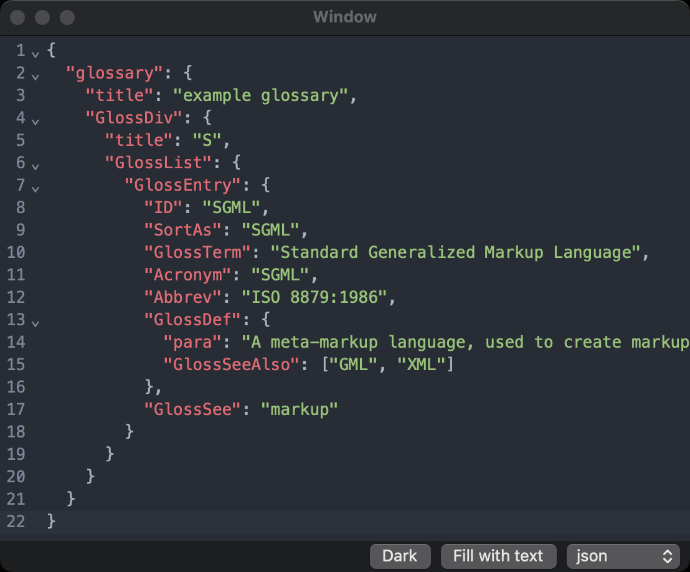

## ✨ Features

- ⚡️ Minimal and fast
- 📱 Supports macOS and iOS

## 📦 SPM

Add `https://github.com/khoi/codemirror-swift` to your dependencies.

## 🚧 Modifications

- Make changes to 
- Run `make build-codemirror`

## 🙇‍♂️ Credit

- https://codemirror.net
- https://github.com/ProxymanApp/CodeMirror-Swift 
